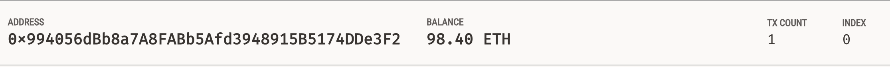
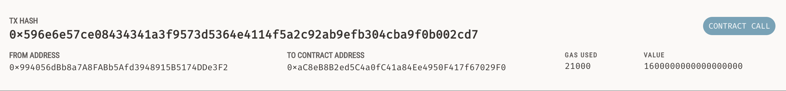

# User Friendly Ledger

>A user friendly Streamlit web application for employeers looking to pay eth wages.
* [What does the applicaiton look like???](#the-application)
* [What does a transaction look like???](#viewing-transactions)

---

## Technologies

Python version 3.9 
* [streamlit](https://streamlit.io/)
* [Web3](https://web3py.readthedocs.io/en/stable/)
* [Mnemonic](https://pypi.org/project/mnemonic/#:~:text=python%2Dmnemonic&text=It%20consists%20of%20two%20parts,BIP%2D0032%20or%20similar%20methods.)
* [Ganache](https://trufflesuite.com/ganache/)

---

## Installation Guide

```python
pip install streamlit
pip install eth-tester
pip install mnemonic
pip install bip44
```

---

## The Application


The application displays the workers and there wages to choose from. On the left side of the page the employer can view their own wallet ballance, choose a worker that suits them, and pay the worker there hourly wage. After the transaction, the employeer can view the verfied transaction at the bottom of the left side of the page.

---

## Viewing Transactions



The employeer can look at his/her wallet to see how much was sent.



Or view the transaction directly to see where the eth was sent and how much eth was used for the gas fee.

---

## Contributors

Main contributer **Santiago Hernandez**
- [dsmannight@gmail.com](dsmannight@gmail.com)

---

## License

This application is free for non-profit use.
